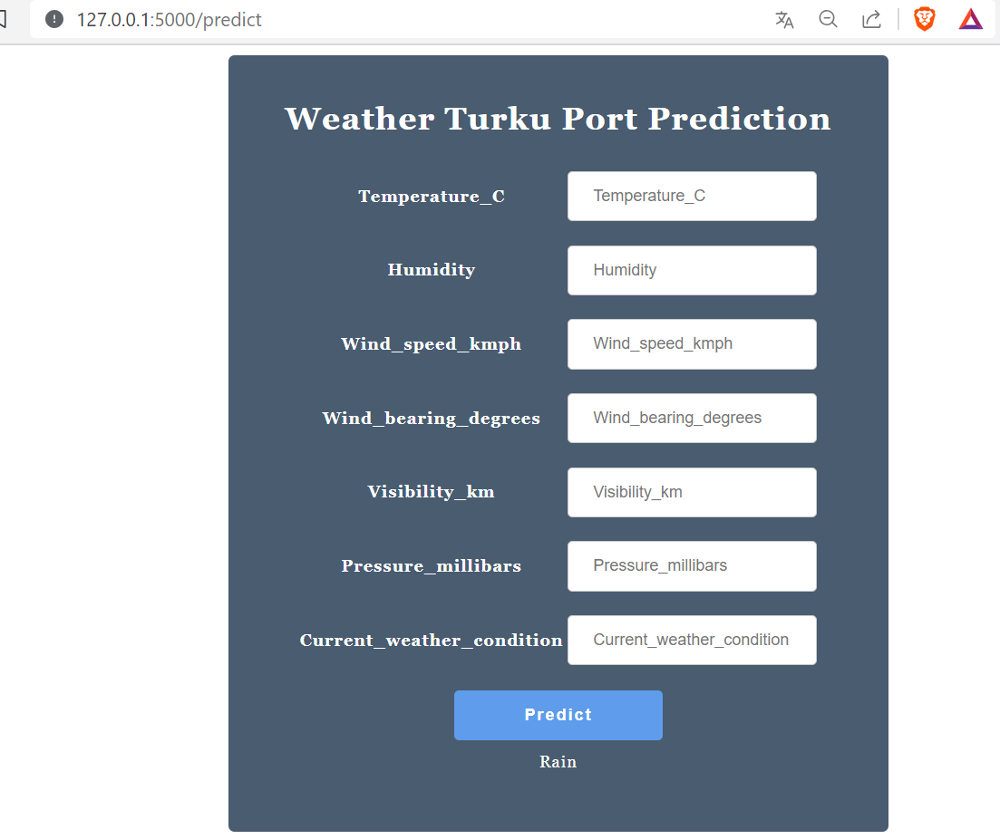

# Atelier_AutoML_Coplilot

# Overview
Deploying a ML model as a service using Azure Auto ML.
Doing Inference using the deployed model.

The aim of this workshop was to create a web application (i.e. a form) allowing you to consume the service. 
Then, using the pre-built image used previously, deploy this application as a container.

### Screen application
Here are a few screens of our application as allowing you to consume the service and as a container.

  

  

  

